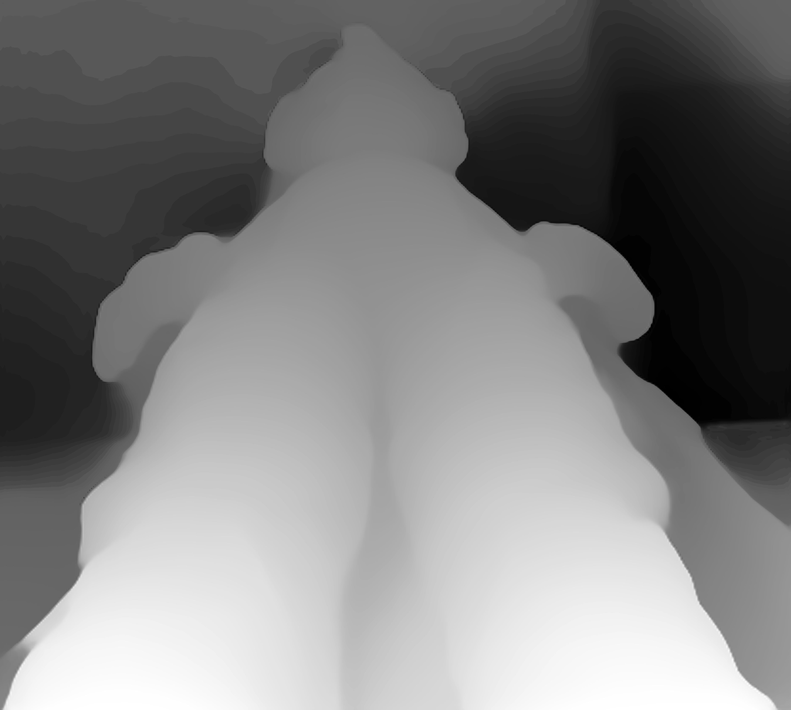

<!-- About -->
### Spatial Video Converter

Quick and dirty python script that uses a MiDaS depth estimation model to generate a depth map, then use that map to displace an image and generate a Spatial Video (mv-hevc) for playback on Apple Vision Pro or Meta HMDs.

<p align = "middle">
  
  
<p align = "middle">

<!-- GETTING STARTED -->
### Prerequisites

You will need FFMPEG, and potentially an Apple Silicon Mac, I haven't tried the Spatial CLI tool on anything else.

### Usage

1. Clone the repo
2. Install requirements, basically just timm, opencv-python, matplotlib, imageio and imageio-ffmpeg
3. Run script with -h or --help to show usage.
   ```sh
   python spatial_video_converter.py --help
   ```


<!-- ROADMAP -->
## Roadmap

- [x] Get it working...
- [ ] Find a way to convert directly to stereo .heic instead of mv-hevc
- [ ] Investigate in-painting to clean up rough edges.
- [ ] Preview tool to show disparity / tweak separation values.


<!-- LICENSE -->
## License

Distributed under the MIT License. See `LICENSE.txt` for more information.


<!-- CONTACT -->
## Contact

BlueSky - [@supscooterr.com](https://bsky.app/profile/supscooterr.com)
Telegram Channel - [Telegram Channel](https://t.me/supscooterr)

<!-- ACKNOWLEDGMENTS -->
## Acknowledgments

* [Mike Swanson's Spatial CLI tool](https://blog.mikeswanson.com/spatial)
* [MiDaS](https://pytorch.org/hub/intelisl_midas_v2/)
